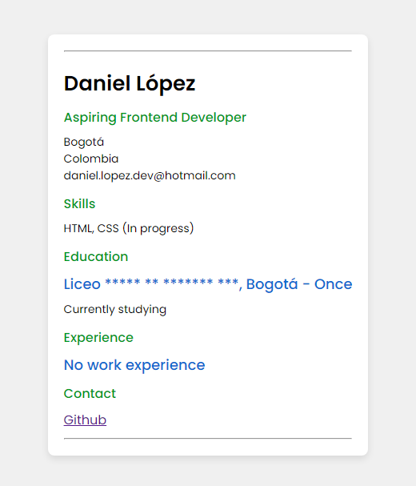

## Single Page CV

Curriculum vitae of **Daniel López**, a frontend developer in Bogotá, Colombia

## Screenshot

## Requirements

- [x] Semantically correct HTML structure.
- [x] Single-page layout with sections for education, skills, and career history.
- [x] SEO meta tags in the head section.
- [x] OG tags for better social media sharing.
- [x] A favicon linked in the head section.

## Link Roadmap.sh

https://roadmap.sh/projects/single-page-cv
